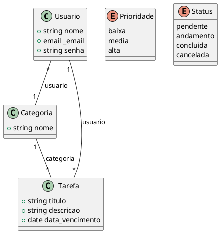

# Diagrama de Domínio

# ToDoApp

## Usuario
Descrição: Classe Sem Descrição
Tabela 1: atributos da entidade Usuario

|Nome|Descrição|Meta Dados|Visibilidade|
|-|-|-|-|
|nome||`string min: * max: * unique: false blank: false`|Public|
|_email||`email min: * max: * unique: false blank: false`|Public|
|senha||`string min: * max: * unique: false blank: false`|Public|

Autor: Autoria Própria

## Categoria
Descrição: // ESSA ENTIDADE AQUI TEM UMA DESCRIÇÃO :)
Tabela 2: atributos da entidade Categoria

|Nome|Descrição|Meta Dados|Visibilidade|
|-|-|-|-|
|nome||`string min: * max: * unique: false blank: false`|Public|

Autor: Autoria Própria

## Tarefa
Descrição: Classe Sem Descrição
Tabela 3: atributos da entidade Tarefa

|Nome|Descrição|Meta Dados|Visibilidade|
|-|-|-|-|
|titulo||`string min: * max: * unique: false blank: false`|Public|
|descricao||`string min: * max: * unique: false blank: false`|Public|
|data_vencimento||`date min: * max: * unique: false blank: false`|Public|

Autor: Autoria Própria