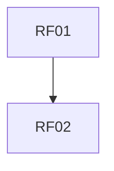

# Requisitos Funcionais
| Item | Descrição | Dependências | Habilitados | Atores |
| --- | --- | --- | --- | --- |
| RF01 | O sistema deve permitir que usuários se cadastrem com nome, email e senha |  | RF02 |  |
| RF10 | O sistema pode enviar notificações sobre tarefas pendentes ou próximas do vencimento |  |  |  |
| RF09 | O sistema deve permitir filtrar tarefas por status, data e categoria |  |  |  |
| RF08 | O sistema deve permitir que o usuário crie e gerencie categorias |  |  |  |
| RF07 | O sistema deve permitir alterar o status das tarefas |  |  |  |
| RF06 | O sistema deve listar as tarefas do usuário |  |  |  |
| RF05 | O sistema deve permitir que o usuário exclua tarefas |  |  |  |
| RF04 | O sistema deve permitir que o usuário edite tarefas existentes |  |  |  |
| RF03 | O sistema deve permitir que o usuário crie novas tarefas |  |  |  |
| RF02 | O sistema deve permitir autenticação dos usuários | RF01 |  |  |


# Requisitos Não Funcionais
| Item | Descrição | Dependências | Habilitados | Atores |
| --- | --- | --- | --- | --- |
| RNF06 | O tempo de resposta das requisições não deve exceder 2 segundos em 95% dos casos |  |  |  |
| RNF05 | O sistema deve suportar pelo menos 100 usuários simultâneos |  |  |  |
| RNF04 | O frontend deve ser desenvolvido em React |  |  |  |
| RNF03 | O backend deve ser desenvolvido em Django |  |  |  |
| RNF02 | Deve ser uma aplicação responsiva, funcionando bem em desktop e mobile |  |  |  |
| RNF01 | O sistema deve ter autenticação segura com criptografia de senha |  |  |  |


# Regras de Negócio
| Item | Descrição | Dependências | Habilitados | Atores |
| --- | --- | --- | --- | --- |
| BR01 | Descrição |  |  |  |


# Grafos de Dependências

## Requisitos Funcionais



## Requisitos Nao Funcionais

```mermaid
graph TD

```

## Regras de Negócio

```mermaid
graph TD

```