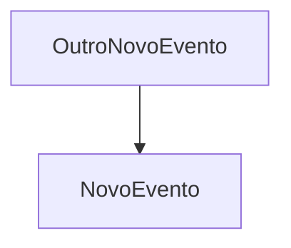

# Caso de Uso

## CADASTRO: Cadastro e Autenticação


## GERENCIAMENTOTAREFAS: Gerenciamento de Tarefas


## ORGANIZACAOTAREFAS: Organização de Tarefas

### NOVOEVENTO.0: Evento de Teste


### OUTRONOVOEVENTO.1: Outro Evento de Teste


## NOTIFICACOES: Notificações


## Matriz dos Casos de Uso
| Item | Descrição | Dependências | Habilitados | Atores |
| --- | --- | --- | --- | --- |
| Notificacoes | Sistema envia lembretes ao usuário |  |  |  |
| OrganizacaoTarefas | Usuário organiza tarefas por categoria, data e status |  |  |  |
| GerenciamentoTarefas | Usuário cria, edita, exclui e altera status das tarefas |  |  |  |
| Cadastro | Usuário se cadastra e faz login |  |  |  |


## Matriz de Dependência dos UC

```mermaid
graph TD

```

## Matriz dos Eventos
| Item | Descrição | Dependências | Habilitados | Atores |
| --- | --- | --- | --- | --- |
| OutroNovoEvento |  |  | NovoEvento |  |
| NovoEvento | Descrição | OutroNovoEvento |  |  |


## Matriz de Dependêcia dos Eventos

